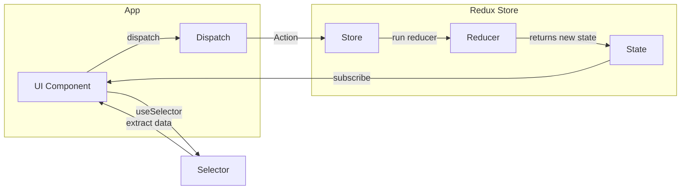

# ToDoList React アプリケーション

## プロジェクト概要
このプロジェクトは、React Hooksを活用したシンプルなToDoリストアプリケーションです。ユーザーはタスクの追加、完了状態の切り替え、削除などの基本的なタスク管理機能を利用できます。

## 主な機能
- タスクの追加
- タスクの完了/未完了の切り替え
- タスクの削除

## 技術スタック
- React 18
- Node.js
- Docker

## プロジェクトの全体像
このプロジェクトは以下のコンポーネント構成で実装されています：

- App: メインコンポーネント（状態管理）
- TodoForm: タスク入力フォーム
- TodoList: タスク一覧表示
- TodoItem: 個別タスク表示

状態管理にはuseReducerを採用し、以下のアクションタイプを実装：
- add: 新規タスク追加
- toggle: タスク状態切り替え
- delete: タスク削除

## 学べること
1. **React Hooks の実践**
   - useReducerによる効率的な状態管理
   - useStateによるフォーム制御

2. **コンポーネント設計**
   - 責務の分離
   - 再利用可能なコンポーネント構造

3. **モダンな開発環境**
   - Dockerによる開発環境の統一
   - コンテナ化されたアプリケーション開発

4. **Reduxを活用した開発**


## セットアップ
```bash
# リポジトリのクローン
git clone [repository-url]

# Docker Composeでアプリケーション起動
docker-compose up